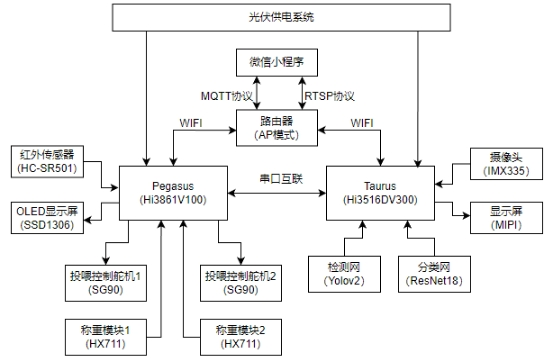
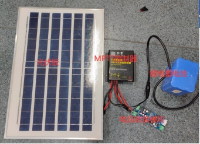
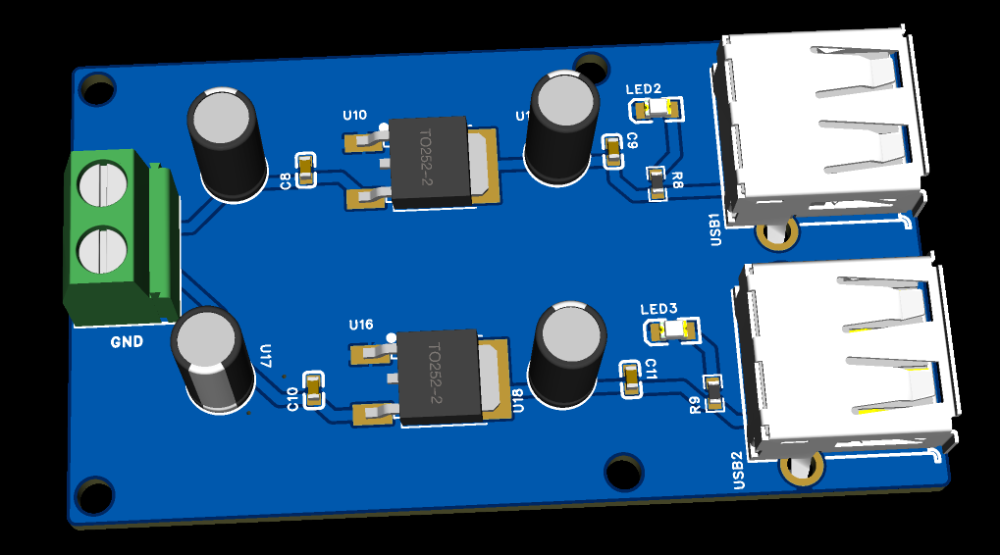

# HiSpark-CatDogHelper
嵌入式芯片与系统设计竞赛2023年海思赛道作品，专为校园流浪猫狗提供服务的AI智能喂食装置——校园喵狗派

## 0 校园喵狗派简介

本项目主要分为Taurus视觉处理端、Pegasus控制端、微信小程序、光伏供电系统四个部分。

 

本项目的工作流程：在红外传感器检测到目标靠近时，Hi3861V100接收到信息后通过串口发送信息唤醒Hi3516DV300开始启动目标检测，若没有检测到目标Hi3516DV300继续进入休眠模式；若检测到目标则进行分类识别，并将识别结果通过串口发送目标种类信息发送给Hi3861V100，并同时将拍摄到的视频进行H264编码，通过RTSP协议实时视频流发送给服务器。Hi3861V100的OLED显示屏能够显示出目标种类，Hi3816V100根据目标种类控制舵机投喂食物，当食物达到设定重量时自动停止投喂。微信小程序能够观看Taurus传输到服务器的视频，可以远程控制投食舵机，查看剩余食物情况；光伏供电系统为Taurus视觉处理端、Pegasus控制端提供电能供应。

## 1 Taurus视觉处理端

### 1.1 配置hi3516开发环境

环境配置和基本编译烧录过程参考：[HiSpark/HiSpark_NICU2023 - 码云 - 开源中国 (gitee.com)](https://gitee.com/HiSpark/HiSpark_NICU2023/tree/master)

### 1.2 配置STA模式和启动视频处理端

配置好环境就可以将Taurus目录下的ai_sample复制到相关目录下编译烧录，即可验证功能。

所需要的模型和bin文件也放在Taurus目录了。

参考[6.2 WiFi互联方式.md · HiSpark/HiSpark_NICU2023 - Gitee.com](https://gitee.com/HiSpark/HiSpark_NICU2023/blob/master/6.2 WiFi互联方式.md#62wifi互联方式)将Taurus设置为STA模式。

```
//连接手机热点
cd /etc/Wireless 
./wpa_supplicant -i wlan0 -c wpa_supplicant.conf &
# 连接热点：
./busybox ./udhcpc -s ./default.script -b -i wlan0

//启动ohos_camera_ai_sample
cd ~
cd /userdata
./ohos_camera_ai_sample 1
//等待pegsus端触发红外
```

### 1.3 RTSP视频流播放

关于rtsp协议可以参考[live555.com/](https://link.zhihu.com/?target=http%3A//www.live555.com/)开源项目

下载VLC播放器[官方下载：VLC media player，最棒的开源播放器 - VideoLAN](https://www.videolan.org/vlc/)

安装完成进行简单设置：工具-》偏好设置-》输入/编解码器-》Live555流传输选择RTP over RTSP（TCP）

选择串流为文件格式（webm），并输入串流网络地址，文件保存在web网页目录下

```
rtsp://192.168.99.85:554/test.264 #192.168.99.85为连接的路由器地址，可以替换成你路由器地址
```

## 2 Pegasus控制端

### 2.1 配置hi3861开发环境

环境配置和基本编译烧录过程参考：[HiSpark/HiSpark_NICU2023 - 码云 - 开源中国 (gitee.com)](https://gitee.com/HiSpark/HiSpark_NICU2023/tree/master)

### 2.2 配置STA模式

配置好环境就可以将Pegasus目录下的cat_dog_pai_demo复制到相关目录下编译烧录，即可验证功能。

参考[[4.5 物联网应用开发.md · HiSpark/HiSpark_NICU2023 - Gitee.com](https://gitee.com/HiSpark/HiSpark_NICU2023/blob/master/4.5 物联网应用开发.md#45物联网应用开发)](https://gitee.com/HiSpark/HiSpark_NICU2023/blob/master/6.2 WiFi互联方式.md#62wifi互联方式)将Pegasus配置好能够通过MQTT协议传输数据到腾讯云平台。

## 3 微信小程序

参考[[4.5 物联网应用开发.md · HiSpark/HiSpark_NICU2023 - Gitee.com](https://gitee.com/HiSpark/HiSpark_NICU2023/blob/master/4.5 物联网应用开发.md#45物联网应用开发)](https://gitee.com/HiSpark/HiSpark_NICU2023/blob/master/6.2 WiFi互联方式.md#62wifi互联方式)对目录WebApp进行修改配置。

注意的是：微信小程序对于个人开发者不太友好，live-player和web-view功能不开放使用。所以我的解决方案是将1.3节串流的视频保存为webm格式视频，然后使用ffmpeg将视频转为MP4存储到微信云开发服务器上，使用播放视频的功能代替直播功能。

## 4 Web网页

网页设计比较简单，实现一个视频播放功能。在此主要说明的是如何将本地电脑作为服务器，然后使用内网穿透让外网用户能够访问到。

内网穿透使用到的工具是[NATAPP-内网穿透 基于ngrok的国内高速内网映射工具](https://natapp.cn/)，仅需要我们注册登录就能使用免费通道（网址不固定，每次重新搭建内网穿透会改变网址）。将natapp下载到web网页目录下。

搭建可参考：【手把手教你上线网站，不用服务器！小白可懂-哔哩哔哩】 https://b23.tv/QtvMYe2

## 5 3D模型(外壳设计)

使用SoildWorks进行外壳设计


## 5 光伏供电系统

### 5.1 光伏供电

光伏板采用一般的单晶板。为了提高充电效率，便于负载管理，光伏充电控制器采用MPTT（最大功率点跟踪算法）充电器，蓄电池采用18650锂电池组24V6Ah；由于Pegasus和Taurus都是5V供电，需要使用电压转换模块将电压转换为5V。



可以参考这套光伏供电系统。

### 5.2  降压模块

采用两颗AMS1086CD-5.0 LDO稳压芯片，并使用USB接口供电。



## 6 一些建议

如果你对本项目有兴趣，想做下去，可以考虑增加识别物种种类（换一个好的应用场景如野生动物监测），也可以从个体跟踪算法进行研究，这对于动物行为轨迹跟踪的研究是有益的。
